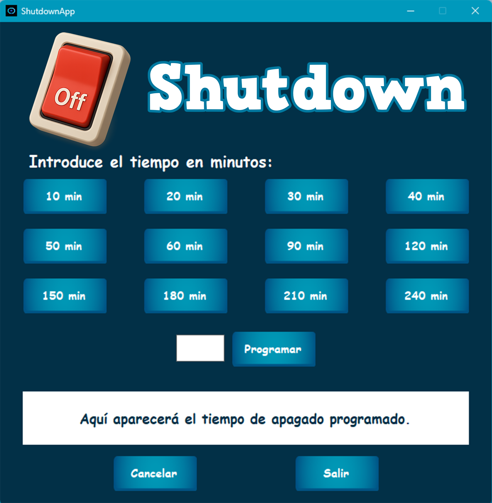

# 💻 ShutdownApp - Apagado Programado (C#)

Una aplicación sencilla de escritorio para Windows, desarrollada en C# con Windows Forms que permite programar fácilmente el apagado de tu PC en un tiempo determinado. Ofrece una interfaz de usuario intuitiva, botones personalizados, soporte para múltiples idiomas, y una gestión robusta de los comandos del sistema.

---

## 🚀 Badges

---

## 📚 Tabla de Contenidos

* [✨ Características](#-características)
* [📸 Capturas de Pantalla](#-capturas-de-pantalla)
* [📋 Requisitos](#-requisitos)
* [🚀 Uso](#-uso)
* [📦 Instalación](#-instalación)
* [🔐 Firma Digital](#-firma-digital)
* [🤝 Contribuciones](#-contribuciones)
* [👤 Autor](#-autor)
* [📄 Licencia](#-licencia)

---

## ✨ Características

*   **Programación de Acciones:** Apagado Programado del PC.
*   **Interfaz Intuitiva:** Diseño amigable y fácil de usar.
*   **Personalización Visual:** Iconos y botones personalizados para una mejor experiencia.
*   **Validación de Entrada:** Asegura que los tiempos de programación sean válidos.
*   **Notificaciones Claras:** Ventanas emergentes para confirmaciones y alertas.
*   **Soporte Multi-idioma:** Disponible en árabe, alemán, inglés, español, francés, hindi, portugués, ruso y chino
*   **Portable:** Ejecutable de un solo archivo que no requiere instalación.
*   **Seguridad:** Firmado digitalmente para mayor confianza.

## 📸 Capturas de Pantalla

## 📋 Requisitos

*   **Sistema Operativo:** Windows 7 o superior.
*   **.NET Runtime:** La aplicación está compilada para .NET 6.0. Si el sistema no lo tiene preinstalado, es posible que se requiera la instalación del [.NET 6.0 Desktop Runtime](https://dotnet.microsoft.com/download/dotnet/6.0/runtime).

## 🚀 Uso

1.  **Ejecuta** el archivo `ShutdownApp.exe`.
2.  **Selecciona** el tiempo en minutos deseado para apagar la PC, o introduce el tiempo en minutos para programar el apagado de tu PC. 
3.  Haz clic en **"Programar"** para iniciar la cuenta regresiva.
4.  Puedes **cancelar** la operación en cualquier momento haciendo clic en "Cancelar".

## 📦 Instalación

La aplicación se distribuye como un **ejecutable portable de un solo archivo**. Simplemente descarga el archivo `ShutdownApp.exe` de la [sección de Releases](https://github.com/Pablitus666/Shutdown/releases) y ejecútalo.

## 🔐 Firma Digital

Este ejecutable está firmado digitalmente para proporcionar una capa adicional de seguridad. Aunque la firma es con un certificado autofirmado, verifica la autenticidad del editor y asegura que el archivo no ha sido alterado.

## 🤝 Contribuciones

Las contribuciones son bienvenidas. Si deseas compilar el proyecto o entender cómo funcionan los flujos de trabajo de CI/CD, consulta la [guía de contribución](CONTRIBUTING.md).

## 👤 Autor

**Pablo Téllez A.**  
Tarija - Bolivia, 2024.

## 📄 Licencia

Este proyecto está licenciado bajo los términos de la [Licencia Pública General GNU versión 3 (GPLv3)](LICENSE).

Puedes leer más en [https://www.gnu.org/licenses/gpl-3.0.html](https://www.gnu.org/licenses/gpl-3.0.html).

